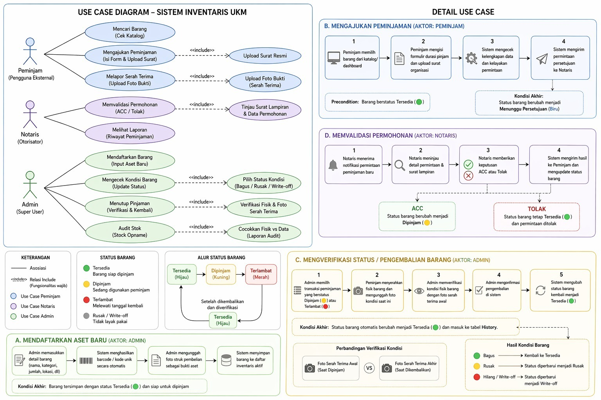

# 📦 Topik Proyek: Sistem Inventaris UKM

## 👥 Anggota Kelompok 9
| **Nama** | **NPM** |
| :--- | :--- |
| Dheka Airlangga | 4524210027 |
| Naila Putri Fahel | 4524210053 |
| Maghfiroh Lisabiliana | 4524210040 |
| Az-Zahra Putri| 4524210018 |
| Ghifari Ezra Ramadhan | 4524210041 |

 
 

# 📌 Informasi & Ruang Lingkup Proyek

## 🎯 Sasaran Pengguna
Sistem Inventaris UKM ini dirancang untuk memfasilitasi koordinasi antara pengelola internal organisasi dan pihak luar yang berkepentingan, dengan rincian sebagai berikut:

* **Pengurus Bidang 4 (Admin):** Sebagai pengelola utama yang bertanggung jawab melakukan input data barang baru, mengelola database inventaris, melacak posisi barang secara real-time, serta melakukan verifikasi fisik saat serah terima barang.

* **Ketua & Bendahara UKM (Notaris):** Sebagai pihak berwenang yang melakukan otorisasi atau persetujuan (approval) terhadap permohonan peminjaman, memantau riwayat aset untuk kebutuhan audit, serta menyetujui penghapusan aset (write-off) jika barang hilang atau rusak.

* **Pihak Eksternal (Peminjam):** Anggota UKM lain atau Himpunan Mahasiswa yang membutuhkan akses ke katalog barang untuk mengecek ketersediaan stok, melakukan pengajuan pinjaman melalui E-Form, dan melaporkan bukti dokumentasi serah terima.

---

## 📚 Referensi & Studi Literatur
Setiap alur dan fitur dalam sistem ini tidak dibangun sekadar berdasarkan asumsi, melainkan dirancang untuk menjawab akar masalah pengelolaan inventaris di lapangan. Berikut adalah rujukan literatur yang memvalidasi pendekatan pada proyek ini:

* **Digitalisasi & Kodifikasi Terpusat:** Penggantian pencatatan manual (Excel/kertas) dengan *database* terpusat dan *generate* kode otomatis terbukti secara signifikan menekan angka *missing link* serta mencegah hilangnya jejak aset.
  > 🔗 **Referensi:** [Sistem Peminjaman Barang Menggunakan QR Code Berbasis Aplikasi Android (JTEKSIS, 2024)](https://doi.org/10.47233/jteksis.v6i2.1350)

* **E-Form & Otorisasi Berlapis:** Penerapan alur digital dengan *role-based access* (Admin, Notaris, Peminjam) menstandarisasi birokrasi, mempercepat proses *approval*, dan mengontrol kepatuhan durasi peminjaman secara sistematis.
  > 🔗 **Referensi:** [Perancangan dan Implementasi Sistem Peminjaman Barang Berbasis Web (Remik, 2025)](http://doi.org/10.33395/remik.v9i1.14365)

* **Akuntabilitas via Digital Handover:** Kewajiban memvalidasi kondisi fisik barang melalui unggahan foto saat serah terima memberikan bukti riwayat yang objektif, mencegah lepas tanggung jawab, dan menjamin validitas Laporan Pertanggungjawaban (LPJ).
  > 🔗 **Referensi:** [Pengembangan Sistem Informasi Peminjaman, Pengembalian, dan Inventarisasi (Bulletin CSR, 2025)](https://hostjournals.com/bulletincsr/article/view/876)

---

## 💬 Hasil Wawancara SOP Inventaris UKM

Klik pada masing-masing bagian di bawah ini untuk melihat detail daftar pertanyaan dan jawaban hasil wawancara terkait *SOP* yang sedang berjalan:

<b>Bagian 1: Pencatatan & Data Masuk (<i>Input</i> Barang Baru)</b>

 

**Q: Bagaimana *SOP* pencatatan ketika ada barang inventaris baru yang masuk/dibeli?**
> Pencatatan saat ini masih dilakukan secara manual. Saat ada pembelian barang baru, *SOP* yang berjalan mewajibkan pengelola inventaris melampirkan struk atau nota fisik. Struk tersebut kemudian diserahkan kepada Bendahara untuk keperluan pencatatan harga dan koordinasi keuangan.

**Q: Apakah ada sistem pelabelan atau pemberian kode unik (nomor seri/kodifikasi) untuk setiap barang? Jika ada, seperti apa formatnya?**
> Belum ada sistem kodifikasi spesifik atau pemberian nomor seri (nomor unit) untuk pelacakan. Pelabelan fisik (seperti penempelan stiker nama) hanya dilakukan secara terbatas pada aset inventaris berukuran besar.

**Q: Saat ini, media apa yang digunakan untuk menyimpan *database* barang? (Apakah buku tulis fisik, Excel, Google Sheets, atau lainnya?)**
> Pendataan barang menggunakan Microsoft Excel, namun penggunaannya belum menyeluruh. *File* Excel tersebut saat ini hanya difokuskan untuk mendata barang-barang aset berukuran besar (contoh: lemari, AC, *printer*), sedangkan barang berukuran kecil belum terekap secara digital.

<b>Bagian 2: Peminjaman (Alur Keluar Barang)</b>

 

**Q: Bagaimana alur pasti (*SOP*) jika ada anggota atau pihak luar yang ingin meminjam barang? (Mulai dari *request* sampai barang diberikan).**
> Pihak eksternal (misalnya UKM lain) diwajibkan mengirimkan surat peminjaman resmi kepada Bidang 4. Bidang 4 menyediakan *template* surat peminjaman (contoh dari divisi RnD) untuk digunakan. Setelah surat diterima, pengurus Bidang 4 akan mengecek ketersediaan dan kondisi fisik barang. Barang dengan kondisi rusak secara otomatis tidak akan dipinjamkan.

**Q: Apakah ada *form* peminjaman khusus atau bukti serah terima barang?**
> Tidak ada formulir fisik atau Berita Acara Serah Terima (BAST) di atas kertas. Bukti serah terima dan pengembalian barang hanya mengandalkan dokumentasi berupa foto barang yang dikirimkan oleh peminjam melalui pesan *chat* kepada pengurus Bidang 4.

**Q: Bagaimana cara kalian menentukan batas waktu maksimal peminjaman untuk suatu barang?**
> Bidang 4 tidak menetapkan aturan baku mengenai durasi maksimal peminjaman. Batas waktu peminjaman sepenuhnya mengikuti tanggal yang diajukan oleh peminjam di dalam draf surat permohonan. Sistem ini sangat mengandalkan kesadaran dari pihak peminjam.

<b>Bagian 3: Pengembalian & Pelacakan (<i>Tracking</i>)</b>

 

**Q: Bagaimana *SOP* pengecekan kondisi barang saat dikembalikan oleh peminjam?**
> Pengecekan kondisi fisik barang secara langsung tatap muka (serah terima fisik) jarang dilakukan. *SOP* pengembalian saat ini hanya meminta pihak peminjam untuk mengirimkan bukti foto barang ke ruang *chat* sebagai konfirmasi bahwa barang telah dikembalikan ke tempatnya.

**Q: Jika barang dikembalikan melewati batas waktu (telat) atau dalam kondisi rusak?**
> Berdasarkan studi kasus sebelumnya (kerusakan tali pada barang RnD yang dipinjam oleh himpunan luar), jika barang dikembalikan dalam kondisi rusak, maka pihak UKM akan menuntut pertanggungjawaban penuh kepada organisasi peminjam yang bersangkutan untuk menyelesaikan masalah tersebut.

**Q: Menggunakan sistem manual saat ini, bagaimana cara kalian melacak (*tracking*) siapa yang sedang memegang suatu barang jika barang tersebut tiba-tiba dibutuhkan?**
> Belum ada mekanisme pelacakan khusus jika barang tiba-tiba dibutuhkan. Pemantauan hanya mengandalkan pengarsipan *soft file* surat peminjaman. Hal ini dikarenakan selama ini mayoritas peminjam mengembalikan barang tepat waktu sesuai tanggal peminjaman.

<b>Bagian 4: Perawatan & Pengecekan Rutin (<i>Stock Opname</i>)</b>

 

**Q: Apakah ada jadwal rutin untuk mengecek kondisi fisik seluruh barang di tempat penyimpanan (*stock opname*)? Jika ya, seberapa sering?**
> Tidak ada jadwal pengecekan fisik barang (*stock opname*) yang dilakukan secara rutin berkala. Pengecekan sering kali bersifat reaktif dan dadakan, khususnya untuk barang habis pakai (seperti ATK atau tinta). Jika barang terlihat habis secara fisik, pengurus baru akan melapor ke Bendahara untuk melakukan pengadaan baru.

**Q: Bagaimana cara kalian mengklasifikasikan atau mencatat status kondisi barang saat ini? (Misal: Baik, Rusak Ringan, Rusak Berat).**
> Pencatatan mengenai status kondisi fisik barang (baik atau rusak) masih dilakukan secara manual dan terbatas hanya pada barang-barang inventaris besar (aset utama).

**Q: Apa kendala utama yang dirasakan saat harus mencocokkan data di catatan dengan jumlah barang fisik yang ada?**
> Kendala terbesar yang dihadapi pengurus saat ini adalah seringnya terjadi selisih (*missing link*) antara data; di mana barang yang tercatat di dalam daftar pencatatan sering kali tidak dapat ditemukan wujud fisiknya di ruangan penyimpanan.

<b>Bagian 5: Penghapusan/Pemutihan Barang Keluar</b>

 

**Q: Jika ada barang yang sudah rusak total atau hilang, bagaimana *SOP* untuk menghapus/memutihkan barang tersebut dari daftar inventaris aktif?**
> Belum ada prosedur pemutihan (penghapusan data barang) dari daftar inventaris aktif. Jika terdapat barang yang rusak total atau hilang, *SOP*-nya adalah melaporkan kejadian tersebut kepada Ketua, dilanjutkan ke Bendahara untuk proses penggantian barang.

**Q: Apakah rekam jejak (*history*) barang yang sudah rusak/hilang tersebut tetap disimpan atau langsung dibuang datanya?**
> Rekam jejak (*history*) barang yang rusak atau hilang tidak dihapus dari sistem pencatatan. Alih-alih dihilangkan, data tersebut diperbarui keterangannya menjadi dalam proses servis (untuk barang elektronik) atau dalam proses penggantian dengan unit yang baru.

---

### 🎥 Video Dokumentasi 

*(Klik gambar di atas untuk memutar video)*

 
 

# 🚨 Masalah

## 📖 Latar Belakang Proyek
Pengelolaan inventaris saat ini terkendala oleh sistem yang terfragmentasi dan minim standarisasi. Ketergantungan pada pencatatan manual dan *database* yang tidak menyeluruh—karena hanya mencakup aset besar sering kali menyebabkan selisih data atau *missing link* antara catatan dan wujud fisik barang. Masalah ini diperparah dengan absennya sistem kodifikasi unik, sehingga pelacakan posisi barang secara spesifik menjadi sangat sulit dilakukan.

Selain itu, terdapat risiko administratif yang tinggi karena ketiadaan dokumen serah terima formal dan durasi pinjam yang tidak diatur secara baku oleh organisasi. Minimnya jadwal *stock opname* rutin serta ketiadaan prosedur pemutihan aset yang jelas mengakibatkan *database* tetap dipenuhi data barang rusak atau hilang, yang pada akhirnya mengaburkan akuntabilitas dan validitas Laporan Pertanggungjawaban (LPJ) UKM.

---

## 📋 Bagian 1: Analisis Aktor

**1. 👨‍💻 Admin (Pengelola Sistem & Inventaris)**  Aktor dengan hak akses tertinggi (*Super User*) yang bertugas:
- **Kelola Pengguna:** Mengatur akun dan hak akses Notaris serta Peminjam.
- **Kelola Inventaris:** Menginput barang baru dan memperbarui status barang (misal: rusak/diservis) tanpa menghapus riwayat data.
- **Verifikasi Bukti:** Mengecek keabsahan foto serah terima dan pengembalian barang.

**2. ✍️ Notaris (Otorisator)**  Pihak berwenang yang memvalidasi transaksi peminjaman:
- **Tinjau Pengajuan:** Memeriksa detail permohonan dan surat dari peminjam.
- **Persetujuan (Approval):** Memberikan keputusan mutlak (ACC atau Tolak).
- **Pantau Riwayat:** Melihat rekam jejak status barang untuk kebutuhan audit.

**3. 🤝 Peminjam (Pengguna Eksternal)**   Pihak luar (misal: UKM/Himpunan) yang meminjam barang:
- **Pengajuan Pinjaman:** Mengecek stok barang dan mengajukan permohonan dengan melampirkan surat resmi.
- **Unggah Bukti:** Wajib melampirkan foto saat mengambil dan mengembalikan barang.
- **Tanggung Jawab:** Menyetujui risiko atas kerusakan atau keterlambatan pengembalian.

---

## ⚖️ Bagian 2: Analisis Perbandingan SOP
*Klik pada masing-masing aspek di bawah ini untuk melihat detail perbandingan alur kerja sebelum dan sesudah implementasi sistem:*

<b>1. Pencatatan & Data Masuk (Input Barang Baru)</b>
 

* **❌ SOP Manual:** Pencatatan bergantung pada struk fisik. Tidak ada kodifikasi/nomor seri terpusat, dan *database* (Excel) hanya digunakan untuk mendata aset berukuran besar.
* **✅ SOP Sistem:** Semua barang langsung diinput ke *database*. Sistem otomatis membuatkan kode unik (ID/Barcode) dan struk pembelian dapat diunggah langsung ke sistem secara *real-time*.

<b>2. Peminjaman (Alur Keluar Barang)</b>
 

* **❌ SOP Manual:** Peminjam mengirim surat fisik/PDF. Tidak ada standar batas waktu peminjaman, dan bukti serah terima hanya mengandalkan kiriman foto via *chat* WhatsApp.
* **✅ SOP Sistem:** Pengajuan melalui *E-Form*. Sistem menolak otomatis jika barang berstatus "Dipinjam" atau "Rusak", membatasi durasi maksimal peminjaman, dan tervalidasi melalui *Digital Handover* di sistem.

<b>3. Pengembalian & Pelacakan (Tracking)</b>
 

* **❌ SOP Manual:** Konfirmasi pengembalian via grup *chat* rentan tertumpuk. Tidak ada pelacakan terpusat siapa yang memegang barang.
* **✅ SOP Sistem:** Terdapat *Dashboard Tracking* interaktif. Sistem mengirim notifikasi *reminder* keterlambatan, dan mewajibkan admin memverifikasi kondisi barang (Baik/Rusak) sebelum transaksi selesai.

<b>4. Perawatan & Pengecekan Rutin (Stock Opname)</b>
 

* **❌ SOP Manual:** Pengecekan bersifat reaktif (menunggu barang habis/rusak), sering menyebabkan selisih data antara catatan dan fisik ruangan.
* **✅ SOP Sistem:** Dilengkapi fitur Audit Cepat (*Stock Opname* berkala) dan *Minimum Stock Alert* untuk memberi peringatan jika barang habis pakai (seperti ATK/tinta) perlu di-restock.

<b>5. Penghapusan/Pemutihan Barang Keluar</b>
 

* **❌ SOP Manual:** Barang hilang/rusak dilaporkan secara lisan. Data hanya diubah menjadi "dalam servis", membuat daftar barang aktif rancu.
* **✅ SOP Sistem:** Menggunakan *Approval Workflow* dari akun Ketua untuk status "Write-off". Data yang dihapus dipindahkan ke tabel *Archive* sehingga tidak mengganggu jumlah aset aktif namun tetap tercatat untuk LPJ.

---

## ⚙️ 3. Use Case
   
## **👥 Ringaksan Aktor** 

| Aktor |  Tujuan | Skenario Tindakan Utama |
| :--- | :--- | :--- |
| **Admin** | **Mendaftarkan Barang** | Menginput aset baru ke database agar tercatat secara digital. |
| | **Mengecek Kondisi** | Memperbarui status fisik barang (contoh: dari 'Bagus' ke 'Rusak'). |
| | **Menutup Pinjaman** | Memverifikasi fisik dan klik tombol **Kembali** untuk menyelesaikan transaksi. |
| | **Audit Stok** | Mencocokkan jumlah fisik di gudang dengan data yang tampil di layar. |
| **Notaris** | **Memvalidasi Permohonan** | Meninjau surat lampiran dan memberikan keputusan **ACC** atau **Tolak**. |
| | **Melihat Laporan** | Mengakses riwayat peminjaman untuk kebutuhan evaluasi dan audit. |
| **Peminjam** | **Mencari Barang** | Mengecek ketersediaan barang pada katalog sebelum mengajukan pinjam. |
| | **Meminta Izin Pinjam** | Mengisi formulir digital dan melampirkan surat resmi organisasi. |
| | **Melapor Serah Terima** | Mengunggah foto bukti fisik saat barang diambil maupun dikembalikan. |

## **Detail Use Case**

## A. Mendaftarkan Aset Baru

**Aktor:** Admin  
**Deskripsi:** Menambahkan barang baru ke dalam database agar dapat dipinjam kembali atau melakukan restock barang yang sudah dikembalikan.

### 🎬 Skenario Admin
1. Admin memasukkan detail barang (nama, kategori, jumlah)
2. Sistem menghasilkan barcode / kode unik secara otomatis
3. Admin mengunggah foto struk pembelian sebagai bukti aset
4. Sistem menyimpan barang ke daftar inventaris aktif

## B. Mengajukan Peminjaman

**Aktor:** Pengguna  
**Precondition:** Barang berstatus **Tersedia (🟢)**

### 🎬 Skenario Pengguna
1. Peminjam memilih barang dari dashboard
2. Peminjam mengisi formulir durasi pinjam dan mengunggah surat organisasi
3. Sistem mengecek kelengkapan data
4. Sistem mengirimkan permintaan persetujuan kepada Notaris

**Kondisi Akhir:**  
Status barang berubah menjadi **Menunggu Persetujuan**

## C. Verifikasi & Pengembalian Barang

**Aktor:** Admin  

### 🎬 Skenario Admin
1. Admin memilih transaksi peminjaman dengan status:
   - Dipinjam (🟡)
   - Terlambat (🔴)
2. Peminjam menyerahkan barang dan mengunggah foto kondisi terbaru
3. Admin memverifikasi kondisi barang dengan foto awal
4. Admin mengonfirmasi pengembalian di sistem
5. Sistem mengubah status barang menjadi **Tersedia (🟢)**

**Kondisi Akhir:**  
Status barang otomatis berubah menjadi **Tersedia (🟢)** dan masuk ke tabel **History**

## **📊 Diagram Use Case**

 
 

# 💡 Solusi

*Sistem ini dibangun dari frustrasi nyata: grup WA yang penuh laporan barang, Excel yang isinya setengah benar, dan tidak ada yang tahu persis mana barang yang masih ada atau sudah lama hilang.*

- 🏷️ **Database Terpusat dengan Kodifikasi Otomatis:** Setiap barang masuk langsung mendapat kode unik tidak peduli ukurannya besar atau kecil. Struk pembelian bisa diunggah langsung. Tidak ada lagi aset yang hanya ada di ingatan pengurus lama.

- 📝 **E-Form Peminjaman:** Pengajuan lewat form digital, bukan PDF ke WA. Yang paling praktis: sistem langsung menolak kalau barang sedang dipinjam atau rusak. Admin tidak perlu cek manual satu per satu. Durasi maksimal peminjaman juga diatur di sini — ini yang selama ini tidak pernah punya standar.

- 📸 **Digital Handover:** Foto serah terima tidak lagi hilang di scroll WA. Peminjam wajib unggah foto kondisi barang waktu ambil dan waktu kembalikan. Admin verifikasi kondisi sebelum transaksi ditutup. Kalau ada kerusakan, ada buktinya.

- 🔔 **Dashboard Tracking & Notifikasi:** Siapapun yang punya akses bisa lihat: barang mana yang keluar, siapa yang pegang, kapan jatuh tempo. Sistem kirim notifikasi otomatis kalau sudah lewat batas — tidak perlu admin jadi *debt collector*.

- 📊 **Stock Opname & Minimum Stock Alert:** Ada fitur audit terjadwal supaya pengecekan tidak lagi reaktif (alias nunggu kehabisan dulu baru panik). Barang habis pakai seperti ATK bisa dipasang ambang batas — sistem yang kasih tahu kalau sudah saatnya *restock*.

- 📂 **Approval Write-Off & Arsip:** Barang rusak atau hilang butuh persetujuan resmi sebelum dihapus dari daftar aktif. Datanya tidak benar-benar hilang — masuk ke tabel Arsip. Jadi waktu LPJ, riwayatnya masih bisa dipertanggungjawabkan.